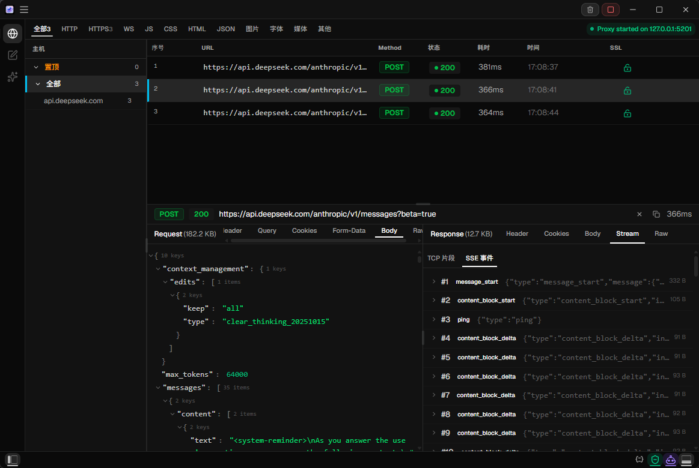
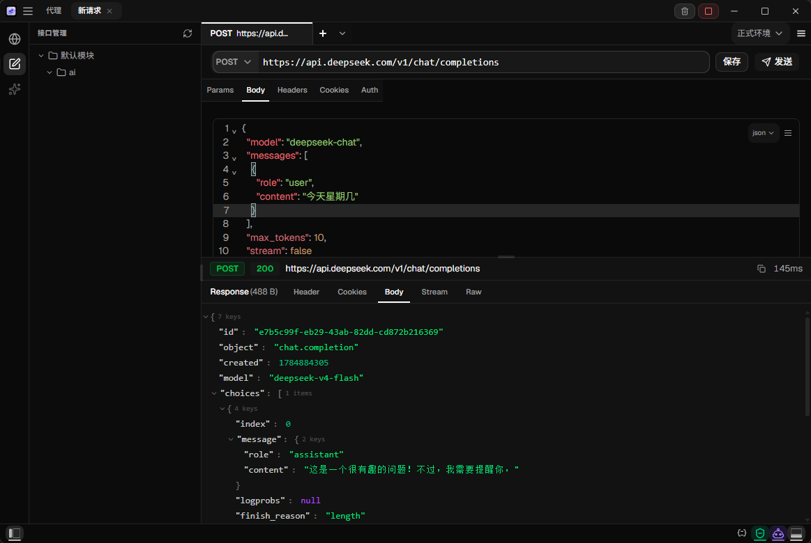
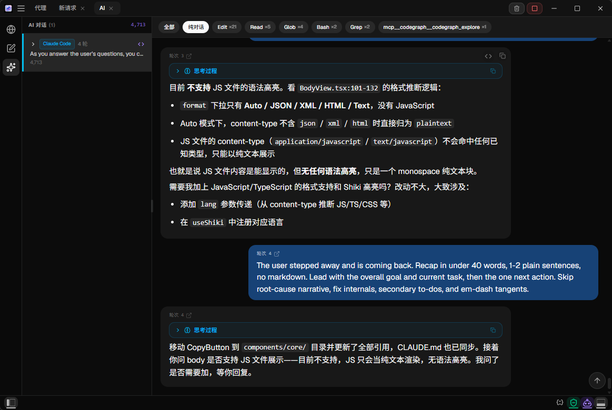
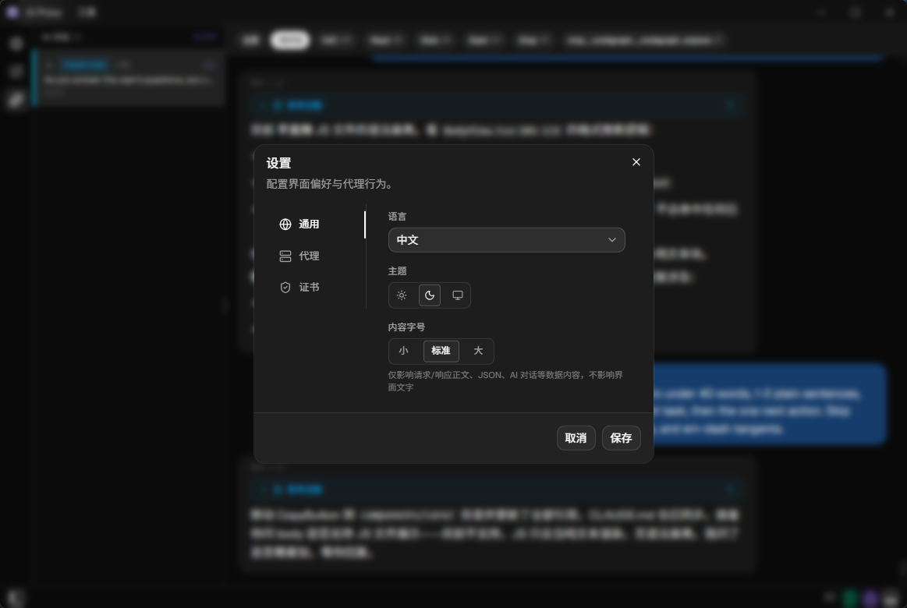

<div align="center">

# AI Proxy

### A desktop MITM proxy for AI API traffic — capture, parse, and replay every conversation with Anthropic, OpenAI, and Gemini

[](https://github.com/lokistars/ai-proxy/releases)
[](https://github.com/lokistars/ai-proxy/releases)
[](https://tauri.app/)
[](https://www.rust-lang.org/)

English | [中文](README_ZH.md)

</div>

## Why AI Proxy?

When you call an AI API, all you see is input and output. But when token usage spikes, responses don't match expectations, or you need to reproduce a specific request, **you need to see what's actually happening on the wire**.

**AI Proxy** is a desktop MITM proxy built specifically for AI API traffic. It not only intercepts HTTP/HTTPS requests, but also **recognizes AI protocols** (Anthropic Messages, OpenAI Chat Completions, OpenAI Responses, Google Gemini) and parses raw JSON bodies into structured conversation turns, token usage, and thinking blocks — letting you debug AI calls the same way you debug REST APIs.

- **Native AI protocol support** — parse turns, usage, and thinking blocks; display conversations semantically, not as raw JSON
- **SSE streaming visualization** — track streaming responses chunk by chunk, watching the model "think" and "respond" in real time
- **Zero-code MITM** — just set your system proxy; no SDK or code changes needed
- **Request replay** — replay any captured request with one click for quick reproduction and comparison
- **Script engine** — built-in JS scripting for intercepting and modifying requests and responses
- **Cross-platform desktop app** — Windows / macOS / Linux, built with Tauri 2

## Screenshots

|                  Traffic Log                  |                  Request Detail                  |
| :-------------------------------------------: | :----------------------------------------------: |
|  |  |

|                  AI Conversation                  |                  Settings                  |
| :-----------------------------------------------: | :----------------------------------------: |
|  |  |

## Features

### Proxy Core

- **HTTP/HTTPS proxy** — MITM reverse proxy based on rama, with TLS decryption
- **Automatic system proxy** — auto-set / auto-clear system proxy settings on start / stop (Windows / macOS / Linux)
- **Upstream proxy chaining** — forward through an upstream proxy for corporate network environments
- **SSL certificate management** — generate, install, and export self-signed CA certificates with one click

### AI Protocol Parsing

- **Multi-protocol normalization** — Anthropic Messages, OpenAI Chat Completions, OpenAI Responses, and Google Gemini unified into `AiTurn` / `AiConversation` structures
- **Token usage tracking** — automatic extraction of `usage` fields (prompt_tokens / completion_tokens / total_tokens), for both streaming and non-streaming responses
- **Thinking block capture** — recognize and display Anthropic thinking blocks and OpenAI reasoning tokens
- **Tool call filtering** — filter or collapse tool_use / tool_result blocks to focus on conversation content

### Traffic Management

- **Real-time traffic log** — all proxied requests displayed live, filterable by type (AI / HTTP / SSE) and status code
- **Request detail panel** — view full Request / Response Headers + Body, with JSON tree expansion
- **SSE streaming display** — every chunk of a streaming response is recorded and displayed
- **Request replay** — select any request, modify parameters, and resend (Postman-style)
- **New request builder** — built-in request constructor for manually crafting API calls

### Script Engine

- **JS scripting** — embedded script engine powered by rquickjs
- **Request/response interception** — modify request headers, body, or response body from scripts
- **Conditional matching** — trigger scripts by URL pattern matching

### User Interface

- **Light / Dark / System theme** — three-mode theme switching with an OKLCH color system
- **Adjustable content font size** — independently scale font size for data-content areas (body / JSON tree / AI conversations)
- **English / Chinese i18n** — full i18n support with system tray locale sync
- **Virtual scrolling** — smooth performance with large traffic logs (virtua)
- **Syntax highlighting** — JSON / XML / JavaScript body rendering via CodeMirror + Shiki

## Usage Guide

### 1. Start the Proxy

Click the **Start** button in the left toolbar (or the toggle in the bottom status bar). The proxy listens on `127.0.0.1:5201` by default.

You can change the listen address and port in the **Settings** dialog — you'll need to **restart the proxy** for changes to take effect. Settings also includes:
- **Upstream proxy**: if your network requires a corporate proxy to reach the internet, configure it here
- **System proxy**: whether to auto-set the system HTTP proxy on start / stop (Windows / macOS / Linux)
- **Data retention**: how many days to keep traffic history (default: 30 days)

Once started, the bottom status bar shows `Running on 127.0.0.1:5201`. It reverts to `Stopped` when the proxy is shut down.

### 2. Configure Your Client

Point your AI SDK or CLI tool's HTTP proxy to the proxy address:

```bash
# Claude Code / Codex / Gemini CLI — set environment variables
export HTTP_PROXY=http://127.0.0.1:5201
export HTTPS_PROXY=http://127.0.0.1:5201
```

```python
# Python OpenAI SDK
import httpx
client = OpenAI(http_client=httpx.Client(proxy="http://127.0.0.1:5201"))
```

```js
// Node.js — set environment variables or configure httpAgent
// export NODE_EXTRA_CA_CERTS=~/.ai-proxy/ca-cert.pem
```

> Since the proxy uses a self-signed certificate, HTTPS requests require the client to trust it. Complete the SSL setup below before first use.

### 3. Install the CA Certificate (required for HTTPS)

The proxy decrypts HTTPS traffic via MITM, so clients need to trust the proxy's generated CA certificate.

Click the **lock icon** in the left toolbar or bottom bar to open the **SSL Config dialog**:

1. The certificate is auto-generated on first launch
2. Click **"Install CA Certificate"** — your OS will prompt for authorization:
   - **Windows**: auto-installs to `CurrentUser\Root` trust store (trusted by Chrome and Edge)
   - **macOS**: installs to the user keychain, requires password authorization
   - **Linux**: installs to the system CA directory via `pkexec` / `sudo`
3. Once installed, clients can make HTTPS requests normally

If you prefer not to install the certificate at the system level, click **"Export"** to save the `.pem` file and configure it in your SDK (e.g. `NODE_EXTRA_CA_CERTS`, `REQUESTS_CA_BUNDLE`, etc.).

### 4. Enable AI Detection (three-layer config)

For the proxy to recognize and parse AI API traffic, three switches work together — they coordinate automatically, but understanding each one helps with troubleshooting:

| Layer | Where | Purpose |
|-------|-------|---------|
| **AI detection master switch** | Bottom bar `AI` badge / AI Config dialog | Controls whether traffic gets AI protocol parsing and normalization |
| **URL rules** | Left toolbar 📡 icon → AI Config dialog | Defines which URLs match which AI provider (OpenAI / Anthropic / Gemini) |
| **SSL decryption** | Bottom bar / SSL Config dialog | Domain whitelist for MITM decryption — encrypted bodies are invisible without it |

**Step-by-step:**

1. **Open the AI Config dialog**: click the 📡 icon in the left toolbar
2. **Turn on the master switch**: toggle `AI Detection` to ON at the top of the dialog
3. **Review the built-in rules**: 7 rules come pre-configured covering major APIs:
   - `api.openai.com/v1/chat/completions` → OpenAI
   - `api.openai.com/v1/responses` → OpenAI Responses
   - `api.anthropic.com/v1/messages` → Anthropic
   - `api.deepseek.com/v1/chat/completions` → OpenAI
   - `*.openai.azure.com/openai/deployments/*/chat/completions` → OpenAI
   - `generativelanguage.googleapis.com/v1beta/models/*` → Gemini
   - `openrouter.ai/api/v1/chat/completions` → Auto-detect
4. **Close and save**: clicking Save will **automatically enable SSL decryption** and add all enabled-rule domains to the SSL whitelist
5. **Verify rules**: use the match-test bar at the bottom of the dialog to test real URLs against your rules

**Each URL rule can be configured with:**
- **Provider**: assign an AI provider (OpenAI / OpenAI Responses / Anthropic / Gemini), or set to "Auto" for backend auto-detection based on Content-Type and request path
- **Sources**: label the request origin (e.g. "Claude Code", "custom script"), paired with a `Merge Header` for session grouping — requests sharing the same session header value are aggregated into one AI conversation view
- **Enable / disable**: toggle individual rules without deleting them

**URL matching**: the candidate string is `host + path` (scheme, query, and default port are stripped). Wildcards `*` and `?` are supported. For example, the rule `api.openai.com/v1/chat/*` matches `https://api.openai.com/v1/chat/completions?model=gpt-5`.

### 5. View AI Conversations

Once configured, AI API requests passing through the proxy are automatically:

1. **Protocol-identified** → matched to a Provider via URL rules
2. **Body-parsed** → conversation turns (user/assistant/system), token usage, and thinking blocks extracted
3. **Stream-tracked** → SSE response chunks accumulated in real time, updating the conversation live
4. **Session-aggregated** → multiple requests sharing the same session header are grouped into one conversation view

In the traffic log, AI requests carry a provider-colored dot. Double-click any request to open the detail panel, then switch to the **AI View tab** to see the structured conversation — including each turn's role, content, token consumption, and thinking blocks (if present).

### 6. Stop the Proxy

Click the start button again to stop the proxy. All network settings are restored. Captured traffic history is persisted in a local SQLite database and remains available for viewing and replay after restart.

## Configuration

The config file lives at `~/.ai-proxy/setting.json` (override the root directory with the `AI_PROXY_HOME` environment variable):

```jsonc
{
  "proxy": {
    "listen_host": "127.0.0.1",  // proxy listen address
    "listen_port": 5201,          // proxy listen port
    "upstream_proxy": false       // whether to use system proxy for upstream
  },
  "ui": {
    "theme": "system",            // light / dark / system
    "language": "zh",             // en / zh
    "prose_font_size": "normal"   // small / normal / large
  },
  "log": {
    "level": "info",
    "dir": null,
    "rolling": "daily"
  }
}
```

## FAQ

<details>
<summary><strong>My AI client can't connect to the proxy — what should I check?</strong></summary>

Check: ① Is the proxy running? (bottom status bar should show "Running on 127.0.0.1:5201"); ② Is your client configured with the correct proxy address (`127.0.0.1:5201`)? ③ For HTTPS, have you trusted the CA certificate?
</details>

<details>
<summary><strong>I see "certificate error" on HTTPS requests — how do I fix it?</strong></summary>

Export the CA certificate (`.pem` format) from the SSL Config dialog and trust it in your system or SDK. For Python SDKs, you can set `verify=False` (development only). For Node.js, set `NODE_TLS_REJECT_UNAUTHORIZED=0`.
</details>

<details>
<summary><strong>Will the proxy affect my normal internet browsing?</strong></summary>

No. When the proxy starts, the system proxy is set to `127.0.0.1:5201`, but the proxy only forwards requests to configured AI API domains. The system proxy is restored when you stop the proxy. You can also disable automatic system-proxy configuration and configure only specific tools to use the proxy.
</details>

<details>
<summary><strong>Where is my data stored?</strong></summary>

- **Settings**: `~/.ai-proxy/setting.json`
- **CA certificate**: `~/.ai-proxy/ca-cert.pem`
- **Scripts**: `~/.ai-proxy/scripts/`
- **Traffic history**: `~/.ai-proxy/traffic.db` (SQLite)
</details>

<details>
<summary><strong>Which AI protocols are supported?</strong></summary>

Four protocols are currently supported:
- **Anthropic Messages** — `/v1/messages`, system + messages[] + content blocks
- **OpenAI Chat Completions** — `/v1/chat/completions`, messages[] + choices[]
- **OpenAI Responses** — `/v1/responses`, input[] + output[]
- **Google Gemini** — `generateContent`, contents[] + candidates[]

Adding a new protocol requires only implementing the `AiProtocol` trait and adding a variant to the `Provider` enum — the compiler guarantees exhaustive coverage.
</details>

<details>
<summary><strong>What can the script engine do?</strong></summary>

Scripts run in JavaScript (rquickjs runtime) and can intercept requests and responses. Example:

```js
// Modify request body
function onRequest(ctx) {
    const body = JSON.parse(ctx.request.body);
    body.max_tokens = 1000;
    ctx.request.body = JSON.stringify(body);
    return ctx;
}

// Log responses
function onResponse(ctx) {
    console.log("Status:", ctx.response.status);
    return ctx;
}
```
</details>

<details>
<summary><strong>How do I get notified when the proxy intercepts AI traffic?</strong></summary>

No notification is needed — all intercepted traffic appears in real time in the traffic log panel. AI requests are marked with a provider-colored dot. Open the AI View tab in the detail panel to see the structured conversation.
</details>

## Architecture

<details>
<summary><strong>Architecture Overview</strong></summary>

### Design Principles

```
┌─────────────────────────────────────────────────────────────┐
│                  Frontend (React 19 + TypeScript)            │
│  ┌─────────────┐  ┌──────────────┐  ┌──────────────────┐    │
│  │  features/  │  │    hooks/     │  │  Tauri invoke()   │    │
│  │ (UI views)  │──│ (Bus. Logic) │──│  (IPC to Rust)    │    │
│  └─────────────┘  └──────────────┘  └──────────────────┘    │
└────────────────────────┬────────────────────────────────────┘
                         │ Tauri IPC (invoke + emit)
┌────────────────────────▼────────────────────────────────────┐
│                   Backend (Tauri + Rust)                     │
│  ┌─────────────┐  ┌──────────────┐  ┌──────────────────┐    │
│  │  commands/  │  │   proxy/     │  │    config/        │    │
│  │ (API Layer) │──│ (Tower Srv)  │──│  (Settings)       │    │
│  └─────────────┘  └──────────────┘  └──────────────────┘    │
└─────────────────────────────────────────────────────────────┘
```

**Core Design Patterns**

- **Tower Service pipeline** — requests pass through layered processing: MITM TLS → AI protocol parsing → traffic recording → script interception → SSE framing → upstream forwarding
- **AI protocol normalization** — `Provider` enum + `AiProtocol` trait, mapping multiple protocols into a unified `AiConversation` structure for consistent frontend rendering
- **Event-driven** — the Rust backend pushes real-time traffic events to the frontend via Tauri `emit`; the frontend `useProxyEvents` hook receives them
- **Unified streaming / non-streaming** — SSE responses are pushed chunk by chunk, non-streaming responses are collected and emitted as one; both share the same AI parsing pipeline
- **Zero-copy pre-parsing** — JSON body is pre-parsed on request arrival; downstream layers reuse the result, avoiding repeated `serde_json::from_slice` calls

**Key Modules**

| Module | Responsibility |
|--------|---------------|
| `proxy/mitm.rs` | MITM TLS decryption, CONNECT tunneling |
| `proxy/layer/` | Tower Layer pipeline (direct / traffic_record / script) |
| `proxy/ai/` | AI protocol identification, normalization, SSE streaming parse |
| `proxy/events.rs` | Traffic event construction and frontend push |
| `proxy/record.rs` | SQLite traffic history persistence |
| `script/` | rquickjs script engine wrapper |
| `config/` | Config loading, persistence, hot-reload |

</details>

<details>
<summary><strong>Project Structure</strong></summary>

```
├── src/                          # Frontend (React 19 + TypeScript)
│   ├── main.tsx                  # Entry point
│   ├── App.tsx                   # Root component: routing, global state, dialogs
│   ├── index.css                 # Tailwind 4 + theme variables (OKLCH)
│   ├── components/
│   │   ├── ui/                   # shadcn/ui primitives
│   │   ├── icons/                # Custom icons
│   │   └── json-tree/            # JSON tree component
│   ├── features/
│   │   ├── proxy/                # Proxy view + traffic log
│   │   ├── new-request/          # Postman-style request builder
│   │   ├── detail-panel/         # Request detail panel
│   │   ├── ai-view/              # AI conversation view
│   │   ├── ai-config/            # AI detection config dialog
│   │   ├── settings/             # Settings dialog
│   │   ├── ssl-config/           # SSL config dialog
│   │   ├── script-config/        # Script config dialog
│   │   ├── title-bar/            # Custom title bar + tabs
│   │   ├── tool-bar/             # Left icon toolbar
│   │   ├── bottom-bar/           # Bottom status bar
│   │   └── about/                # About dialog
│   ├── hooks/                    # Cross-feature reusable hooks
│   ├── lib/                      # Utility functions
│   ├── locales/                  # Translation files (en.json / zh.json)
│   └── types/                    # TypeScript type definitions
├── src-tauri/                    # Backend (Rust)
│   └── src/
│       ├── main.rs               # Binary entry point
│       ├── lib.rs                # Tauri app builder, AppState, events
│       ├── commands/             # Tauri invoke commands
│       ├── config/               # Config loading and storage
│       ├── storage/              # SQLite data access layer
│       ├── proxy/                # MITM proxy core
│       │   ├── ai/               # AI protocol parsing engine
│       │   └── layer/            # Tower Layer pipeline
│       ├── script/               # rquickjs script engine
│       └── tray.rs               # System tray
├── scripts/                      # Development scripts
└── vite.config.ts
```

</details>

## License

MIT © lokistars
